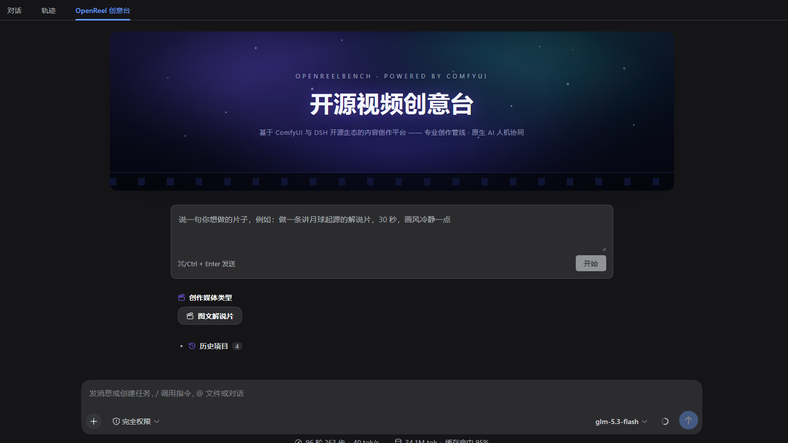
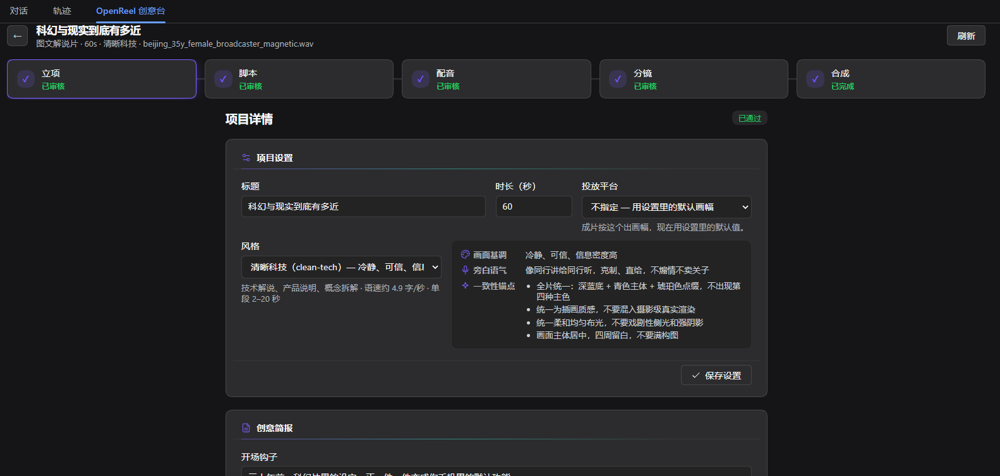
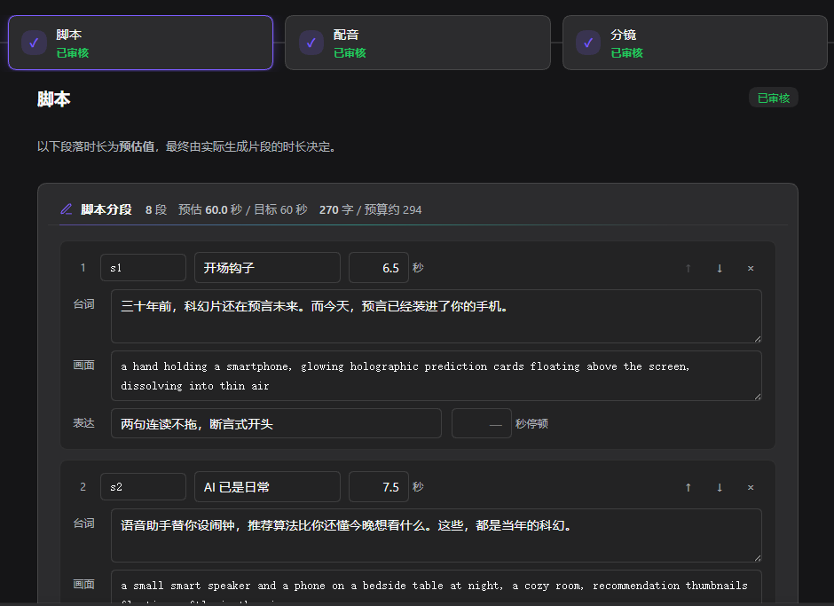
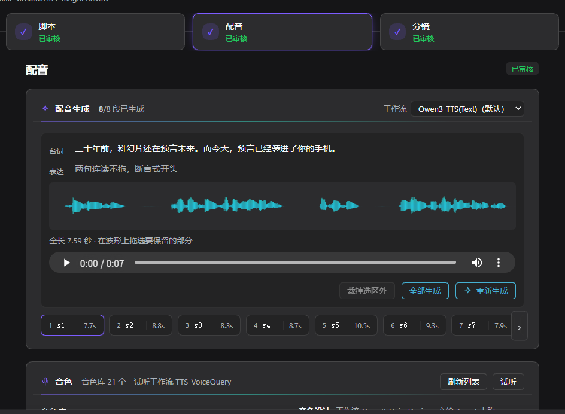
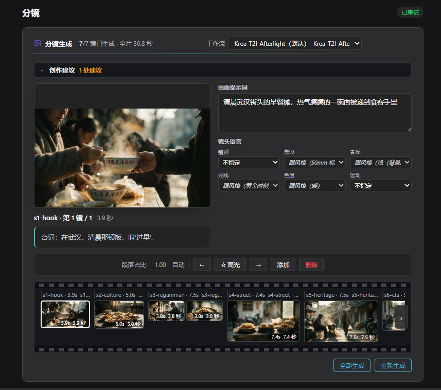
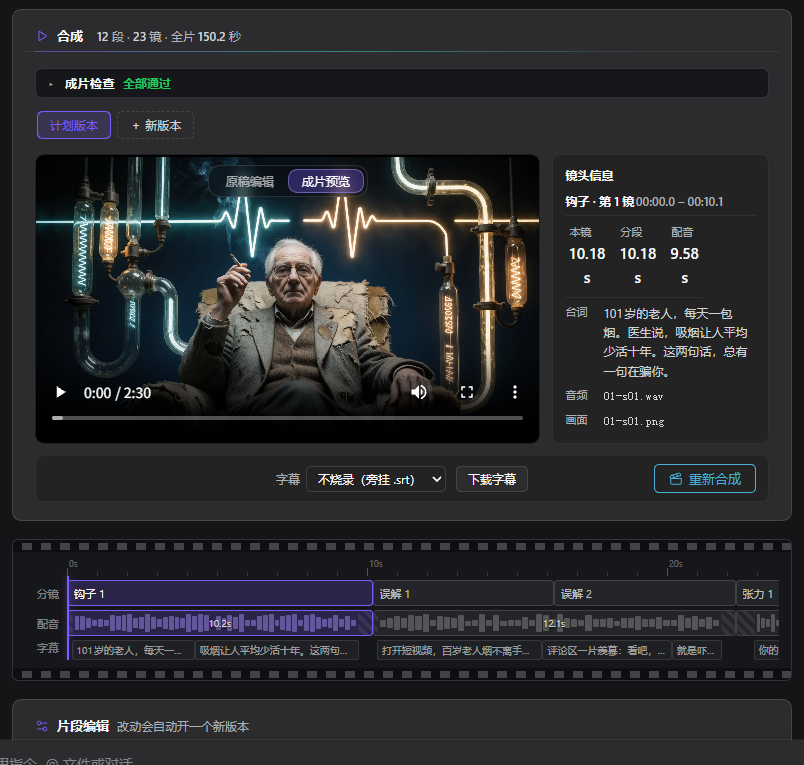

# dsh-openreelbench

**中文**:[README.md](README.md)

**OpenReelbench, the open-source video creative bench** — one sentence in, one narrated film out.

<div align="center">
  
</div>

## Why we built it

Language models write. ComfyUI paints. Voice models speak. Yet between "one sentence" and "a
watchable film" lie dozens of round-trips: what to write, what to show, what comes first, who
decides, who catches the mistakes.

OpenReelbench paves that road. It is an open-source creativity plugin for
[DeepSeek Harness](https://github.com/fandc520/dsh): you speak the idea, the AI turns it into a
complete explainer film — and the authorship stays in your hands.

We believe the open-source ecosystem has never lacked generation capability; what it lacks is a
spine that organizes that capability into **authorship**. OpenReelbench is a serious step in that
direction — bringing the potential of artificial intelligence into the open-source ecosystem as
creative power.

## A governed creative pipeline

Four stages, two human gates. Where progress should wait for you, it truly waits — every gate is
released by your own hand:

```
brief ──〔your approval〕──> script ──〔your approval〕──> voice · imagery ──> compose
```

- **Brief** — one sentence becomes a clear creative intent: topic, duration, frame, style.
- **Script** — a section is a shot; length per section follows the style's speech rate, and image
  prompts describe only what the camera can see.
- **Assets** — narration and imagery generate in batches, without stepping on each other;
  durations are measured, never taken on faith.
- **Compose** — timeline, subtitles and the mix come together in one pass; you get the film and
  its subtitle file.

Imagery, narration and music are generated by [dsh-comfyui](https://github.com/fandc520/dsh-comfyui)'s
ComfyUI workflows; assembly happens locally with FFmpeg. You never open the ComfyUI UI, you never
write an ffmpeg command — **from idea to film, you only care about the content.**

For the agent, all of it collapses into five tools: projects, the state machine, compose, preview
and editing. Capability has boundaries, so creation has no loose ends.

## Eleven skills, all the way

Above the pipeline, eleven built-in skills walk the whole journey — half of them guard the
creative quality, the other half assist the craft:

| Guarding creativity | Assisting the craft |
|---|---|
| **Review protocol** — critique itself before submitting | **The explainer playbook** — the node map and the ground rules |
| **Storytelling** — causal chains, hooks, the film-wide arc | **Brief · Script · Voice · Shots · Compose** — a working sheet per stage |
| **Cinematography** — framing, light and the hero shot | **Tool contract** — how the tools behave, how to read their errors |
| **Sound design** — the hard rules of picking music | |

## Screenshots

<div align="center">
  <br/>
  <em>Project settings</em>
</div>

<div align="center">
  <br/>
  <em>The script sheet — a section is a shot</em>
</div>

<div align="center">
  <br/>
  <em>Narration — voice, sample takes, batch generation</em>
</div>

<div align="center">
  <br/>
  <em>Shots — cinematography in every frame</em>
</div>

<div align="center">
  <br/>
  <em>Compose — timeline, subtitles and music</em>
</div>

## Install

- **DeepSeek Harness ≥ 0.1.2** (the 0.1.5-rc line recommended), Node ≥ 22.19, `ffmpeg` / `ffprobe` on PATH
- **Companion plugin**: [dsh-comfyui](https://github.com/fandc520/dsh-comfyui) ≥ 0.4.0 — the execution end of every generation; install it first and prepare your workflows

```sh
npx -p @deepseek-ai/dsh dsh plugin --profile <your profile> add github:fandc520/dsh-openreelbench
```

Restart the profile after installing. Configure it under **Settings → OpenReel Creative Bench**,
or the `openreel` layer of `cordis.yml` — the binding table only carries workflow **names**; how
to drive each workflow is decided by its own parameter sheet.
More in [the plugin development standard](docs/PLUGIN_DEVELOPMENT.md).

## This is only the beginning

OpenReelbench today ships a single **illustrated explainer** pipeline — the first steps along the
simplest video creation flow there is. Video ads, creative shorts, digital humans… more content
pipelines will grow on the same spine.

It is an experiment in human–AI co-creation for the intelligent era — and a solid foundation for
the fully intelligent, automated creation to come.

## License

MIT
